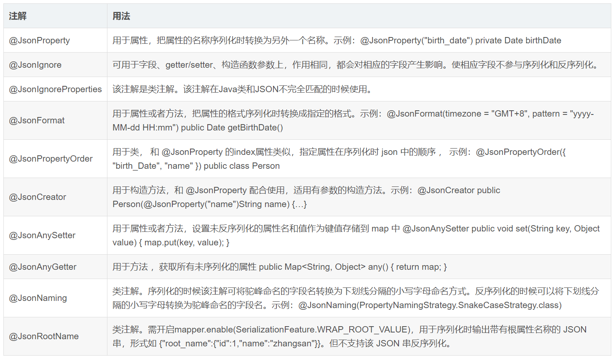

1. [jackson使用](https://blog.csdn.net/weixin_44747933/article/details/108301626)

# 1.Jackson配置
在调用 writeValue 或调用 readValue 方法之前，往往需要设置 ObjectMapper 的相关配置信息。这些配置信息应用 java 对象的所有属性上
```text
//在反序列化时忽略在 json 中存在但 Java 对象不存在的属性
mapper.configure(DeserializationFeature.FAIL_ON_UNKNOWN_PROPERTIES, false);
//在序列化时日期格式默认为 yyyy-MM-dd'T'HH:mm:ss.SSSZ
mapper.configure(SerializationFeature.WRITE_DATES_AS_TIMESTAMPS, false);
//在序列化时自定义时间日期格式
mapper.setDateFormat(new SimpleDateFormat("yyyy-MM-dd HH:mm:ss"));
//在序列化时忽略值为 null 的属性
mapper.setSerializationInclusion(JsonInclude.Include.NON_NULL);
//在序列化时忽略值为默认值的属性
mapper.setDefaultPropertyInclusion(JsonInclude.Include.NON_DEFAULT);
```

# 2.Jackson注解
Jackson 根据它的默认方式序列化和反序列化 java 对象，若根据实际需要，灵活的调整它的默认方式，可以使用 Jackson 的注解。常用的注解及用法如下。

