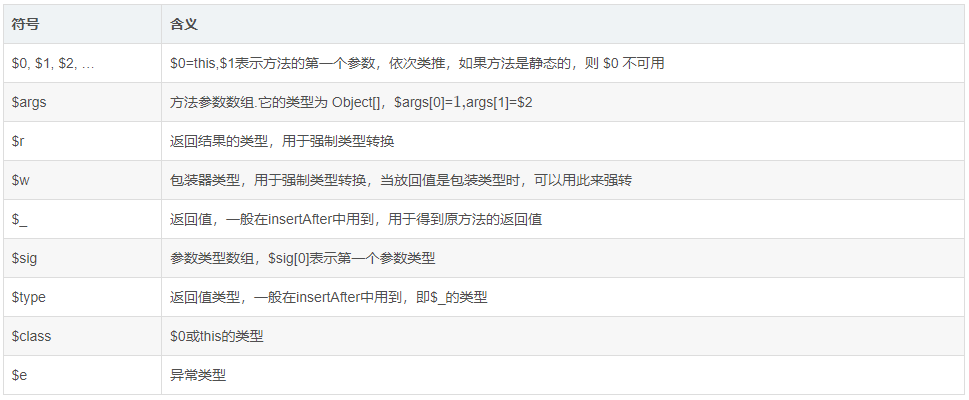

https://blog.csdn.net/mChenys/article/details/122901039
https://www.w3cschool.cn/article/35230124.html
1. javassist类库实现动态创建类、添加类的属性和方法、设置类的父类，以及修改类的方法等操作
2. Javassist不允许删除方法或字段，但它允许更改名称。所以，如果一个方法是没有必要的，\
可以通过调用CtMethod的setName和setModifiers中将其改为一个私有方法。
3. Javassist不允许向现有方法添加额外的参数。你可以通过新建一个方法达到同样的效果

# 冻结与解冻
```text
如果一个 CtClass 对象通过 writeFile(), toClass(), toBytecode()(javassit提供的方法)被转换成一个类文件，
此 CtClass 对象会被冻结起来，不允许再修改。因为一个类只能被 JVM 加载一次。
但是，一个冷冻的 CtClass 也可以被解冻，例如：
CtClasss cc = ...;
    :
cc.writeFile();
cc.defrost();
cc.setSuperclass(...);    // 因为类已经被解冻，所以这里可以调用成功

调用 defrost() 之后，此 CtClass 对象又可以被修改了。

如果 ClassPool.doPruning 被设置为 true，Javassist 在冻结 CtClass 时，会修剪 CtClass 的数据结构。为了减少内存的消耗，
修剪操作会丢弃 CtClass 对象中不必要的属性。例如，Code_attribute 结构会被丢弃。
一个 CtClass 对象被修改之后，方法的字节码是不可访问的，但是方法名称、方法签名、注解信息可以被访问。
修剪过的 CtClass 对象不能再次被解冻。ClassPool.doPruning 的默认值为 false。

stopPruning() 可以用来驳回修剪操作。

CtClasss cc = ...;
cc.stopPruning(true);
    :
cc.writeFile(); // 转换成一个 class 文件
// cc is not pruned.
这个 CtClass 没有被修剪，所以在 writeFile() 之后，可以被解冻。
```

# 类路径搜索
通过ClassPool.getDefault()获取的ClassPool使用 JVM 的类搜索路径。如果程序运行在JBoss或者Tomcat等 Web 服务器上，ClassPool可能无法找到用户的类，因为 Web 服务器使用多个类加载器作为系统类加载器。在这种情况下，ClassPool 必须添加额外的类搜索路径。

1）通过ClassClassPath添加搜索路径
pool.insertClassPath(new ClassClassPath(Person.getClass()));
上面的语句将Person类添加到pool的类加载路径中。但在实践中，我发现通过这个可以将Person类所在的整个jar包添加到类加载路径中。

2）通过指定目录来添加搜索路径
也可以注册一个目录作为类搜索路径：
如pool.insertClassPath("/usr/javalib");则是将 /usr/javalib目录添加到类搜索路径中。
3）通过URL指定搜索路径
ClassPool pool = ClassPool.getDefault();
ClassPath cp = new URLClassPath("www.sample.com", 80, "/out/", "com.test.");
pool.insertClassPath(cp);
上述代码将http://www.sample.com:80/out添加到类搜索路径。并且这个URL只能搜索 com.test包里面的类。例如，为了加载 com.test.Person，它的类文件会从获取http://www.sample.com:80/out/com/test/Person.class获取。

4）通过ByteArrayPath添加搜索路径
ClassPool cp = ClassPool.getDefault();
byte[] buf = 字节数组;
String name = 类名;
cp.insertClassPath(new ByteArrayClassPath(name, buf));
CtClass cc = cp.get(name);
示例中的 CtClass 对象是字节数据buf代表的class文件。将对应的类名传递给ClassPool的get()方法，就可以从字节数组中读取到对应的类文件。

5）通过输入流加载class
如果你不知道类的全名，可以使用makeClass()方法：
ClassPool cp = ClassPool.getDefault();
InputStream ins =  class文件对应的输入流;
CtClass cc = cp.makeClass(ins);
makeClass()返回从给定输入流构造的CtClass对象。你可以使用makeClass()将类文件提供给ClassPool对象。如果搜索路径包含大的jar文件，这可能会提高性能。由于ClassPool对象按需读取类文件，它可能会重复搜索整个jar文件中的每个类文件。makeClass()可以用于优化此搜索。由makeClass()构造的CtClass保存在ClassPool对象中，从而使得类文件不会再被读取。

# $符号

1）$e的使用场景
在给方法添加catch语句块的时候就会用到了，例如
// 创建printAge方法
val printAge: CtMethod = CtMethod.make("public void printAge(){System.out.println(age);}", person)
// 给printAge添加catch语句块，在kotlin中$需要转义
printAge.addCatch("{System.out.println(\$e);throw \$e;}", pool.get("java.lang.Exception"))
// 添加到person类中
person.addMethod(printAge)
效果如下：
public void printAge() {
try {
System.out.println(this.age);
} catch (Exception var2) {
System.out.println(var2);
throw var2;
}
}
2）$r的使用场景
例如给Person类添加一个convert方法
val convert = CtNewMethod.make("public int convert(){ Double d= 12.5;return (\$r)d;} ", person)
person.addMethod(convert)
等价于：
public int convert() {
double var1 = 12.5D;
return (Integer)var1;
}
