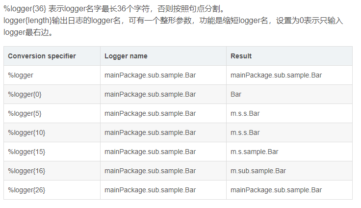
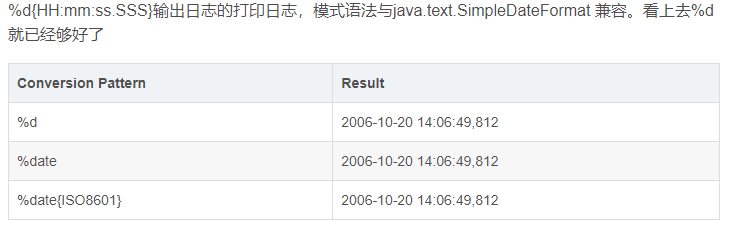
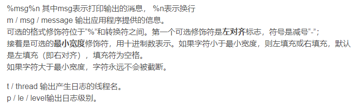

# 1.配置文件作用域

Logback 会在类路径下寻找名为logback-test.xml 的文件。

* 如果没有找到，logback 会继续寻找名为 logback.groovy 的文件。
* 如果没有找到，logback 会继续寻找名为 logback.xml 的文件。
* 如果没有找到，将会通过 JDK 提供的 ServiceLoader 工具在类路径下寻找文件 META-INFO/services/ch.qos.logback.classic.spi.Configurator，该文件的内容为实现了
  Configurator 接口的实现类的全限定类名。
* 如果以上都没有成功，logback 会通过BasicConfigurator 为自己进行配置，并且日志将会全部在控制台打印出来。

# 2.配置文件结构

Logback主要包含三个组成部分：Loggers（日志记录器）、Appender（输出目的在）、Layouts（日志输出格式）

```xml
<?xml version="1.0" encoding="UTF-8"?>
<configuration debug="false" scan="true" scanPeriod="1 seconds">
    <!--设置日志上下文名称，在encoder中可以通过%contextName来打印日志上下文名称-->
    <contextName>logback</contextName>

    <!--自定义一个变量属性-->
    <property name="log.path" value="/tmp/logs"/>
    <!--引入外部文件的kv属性-->
    <property file="/conf/variables.properties"/>


    <!--一个appender，需要为整个appender定义一个名称，以及指定该appender绑定的实体类路径-->
    <appender name="xx" class="">
        <!--使用自定义拦截器-->
        <!-- <filter class="com.example.logback.filter.MyFilter" /> -->
        <!--使用系统提供的拦截器-->
        <filter class="ch.qos.logback.classic.filter.ThresholdFilter">
            <level>ERROR</level>
        </filter>
        <!--输出格式-->
        <encoder>
            <pattern>%d{HH:mm:ss.SSS} %contextName [%thread] %-5level %logger{36} - %msg%n
            </pattern>
        </encoder>
    </appender>


    <appender name="file" class="ch.qos.logback.core.rolling.RollingFileAppender">
        <!--设置保存的文件的路径，这里引用了定义的属性log.path-->
        <file>${log.path}</file>
        <!--归档，当触发某些条件之后会对日志进行归档-->
        <rollingPolicy class="ch.qos.logback.core.rolling.TimeBasedRollingPolicy">
        <!--进行归档的文件名，如下配置将文件归档成zip-->
            <fileNamePattern>${log.path}.%d{yyyy-MM-dd}.zip</fileNamePattern>
        </rollingPolicy>

        <encoder>
            <pattern>%date %level [%thread] %logger{36} [%file : %line] %msg%n
            </pattern>
        </encoder>
    </appender>

    <!--如果appender没有设置日志级别，则以root标签中设置的为准-->
    <root level="日志级别">
        <appender-ref ref="引用某个appender名称"/>
        <appender-ref ref="引用某个appender名称"/>
    </root>

    <!-- name 属性表示匹配的logger类型前缀 -->
    <logger name="com.taobao.jingwei.monitor">
        <level value="WARN"/>
        <!-- 引用的appender，类似于spring的ref -->
        <appender-ref ref="xx"/>
    </logger>
</configuration>
```

* configuration

> * scan,当此属性设置为true时，配置文件如果发生改变，将会被重新加载，默认值为true。
>* scanPeriod,设置监测配置文件是否有修改的时间间隔，如果没有给出时间单位，默认单位是毫秒。当scan为true时，此属性生效。默认的时间间隔为1分钟。
>* debug,当此属性设置为true时，将打印出logback内部日志信息，实时查看logback运行状态。默认值为false。

* property：可以用来设置变量，可以通过${name}来访问。
* appender

> * appender格式化日志输出节点，有俩个属性name和class，class用来指定哪种输出策略，常用就是控制台输出策略和文件输出策略
> * filter 日志输出拦截器，可以自定义拦截器也可以用系统一些定义好的拦截器

```java
public class MyFilter extends Filter<ILoggingEvent> {
    @Override
    public FilterReply decide(ILoggingEvent event) {
        if (event.getMessage().contains("sample")) {
            return FilterReply.ACCEPT; //允许输入串
        } else {
            return FilterReply.DENY; //不允许输出
        }
    }
}
```

> 如果需要用到系统定义的拦截器，例如我们用ThresholdFilter来过滤掉ERROR级别以下的日志不输出到文件中

```xml

<filter class="ch.qos.logback.classic.filter.ThresholdFilter">
    <level>ERROR</level>
</filter>
```

> * encoder和pattern节点组合用于具体输出的日志格式\
    \
    \
    


> * rollingPolicy日志回滚策略。
>> * fileNamePattern，需要设置相当于日志文件名。
>> * maxHistory ,可选是否设置，控制保留的归档文件的最大数量，超出数量就删除旧文件,，例如设置为30的话，则30天之后，旧的日志就会被删除
>> * totalSizeCap，可选是否设置，用来指定日志文件的上限大小，例如设置为3GB的话，那么到了这个值，就会删除旧的日志

```xml
<!--举例-->
<appender name="ROLLING" class="ch.qos.logback.core.rolling.RollingFileAppender">
    <file>mylog.txt</file>
    <rollingPolicy class="ch.qos.logback.core.rolling.SizeAndTimeBasedRollingPolicy">
        <!-- 每天一归档 -->
        <fileNamePattern>mylog-%d{yyyy-MM-dd}.%i.txt</fileNamePattern>
        <!-- 单个日志文件最多 100MB, 60天的日志周期，最大不能超过20GB,窗口大小是1到3，当保存了3个归档文件后，将覆盖最早的日志 -->
        <maxFileSize>100MB</maxFileSize>
        <maxHistory>60</maxHistory>
        <totalSizeCap>20GB</totalSizeCap>
        <minIndex>1</minIndex>
        　
        <maxIndex>3</maxIndex>
    </rollingPolicy>
    <encoder>
        <pattern>%msg%n</pattern>
    </encoder>
</appender>
```

* root:root必须配置，用来指定最基础的日志输出级别，在root标签里需要引用自己设置的appender
* logger：可以选择配置，用来具体指明java包的日志输出级别，它将会覆盖root的输出级别

## 2.1 日志记录优先级

> 通常所有日志框架都会有，优先级从高到低ERROR、WARN、INFO、DEBUG的四中级别。\
> 通过在这里定义的级别，可以控制到应用程序中相应级别的日志信息的开关。\
> 如果定义了INFO级别，则应用程序中所有DEBUG级别的日志信息将不被打印出来

* 注意定义了某个日志级别，低级别的日志的输出则不会生效

## 2.2 appender

定义日志信息的输出地、输出格式、输出规则的配置

# 3. 细节

## 3.1 初始化

导入的包一定是slf4j

```text
private static final Logger logger = LoggerFactory.getLogger(xx类.class);
```

## 3.2 日志级别选择

* ERROR（错误） 一般用来记录程序中发生的任何异常错误信息（Throwable），或者是记录业务逻辑出错。
* WARN（警告） 一般用来记录一些用户输入参数错误
* INFO（信息） 默认的日志级别，用来记录程序运行中的一些有用的信息。如程序运行开始、结束、耗时、重要参数等信息，需要注意有选择性的有意义的输出，到时候自己找问题看一堆日志却找不到关键日志就没意义了
* DEBUG（调试） 这个级别一般记录一些运行中的中间参数信息，只允许在测试环境开启，选择性在开发环境开启。

## 3.3 错误信息记录方式

如下代码，这样不会记录详细的堆栈异常信息，只会记录错误基本描述信息，不利于排查问题。

```text
try{

}catch (Exception e) {
   LOG.error('{} 发生异常', e.getMessage());
}
```

正确方式

```text
try{

}catch (Exception e) {
  LOG.error('发生异常', e);
}
```

## 3.4不要大循环中打印日志

如果使用了性能不高的Log4j框架，那就不要在上千个for循环中打印日志（即使使用了高性能日志也不建议），这样可能会拖垮你的应用程序，如果你的程序响应时间变慢。
最好的办法是在循环中记录要点，在循环外面总结打印出来。

```text
  for(int i=0; i<2000; i++){
      LOG.info("XX");
  }
```

## 3.5 建议记录日志的操作

* 异常捕获处：在捕获异常处输出日志，大家在基本都能做到，唯一需要注意的是怎么输出一个简单明了的日志信息。这在后面的问题问题中有进一步说明。
* 调用外部接口处：在调用外部系统时，我们需要输出日志记录返回的结果。
* 关键操作：关键操作的日志一般是INFO级别，如果数量、频度很高，可以考虑使用DEBUG级别。\
  删除：删除一个文件、删除一组重要数据库记录…… \
  添加：和外系统交互时，收到了一个文件、收到了一个任务…… \
  处理：开始、结束一条任务……

