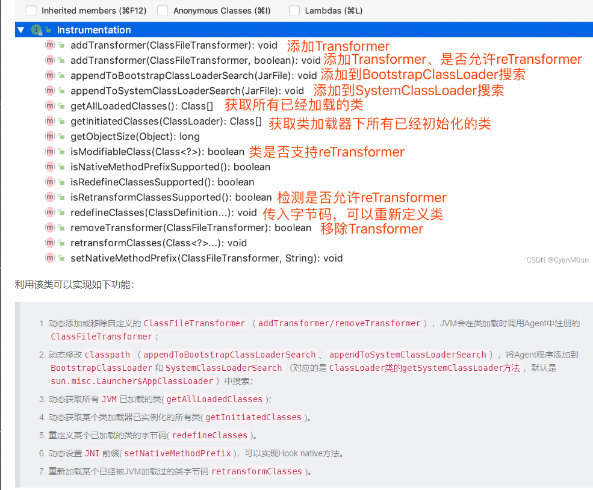

https://blog.csdn.net/weixin_54902210/article/details/129562446



https://blog.csdn.net/WDWAGAAFGAGDADSA/article/details/122270281

# ClassFileTransformer

https://www.cnblogs.com/liboware/p/12497621.html
https://blog.csdn.net/NEWCIH/article/details/129195677
https://zhuanlan.zhihu.com/p/74255330
接口中明确说到，当你不需要对一个类的字节码进行处理的时候，
就返回 null 或者 new byte[0]。而如果需要处理的时候，就返回一个新的字节数组。
一个代理实现ClassFileTransformer接口用于改变运行时的字节码（class File），这个改变发生在jvm加载这个类之前。对所有的类加载器有效。

```java

public interface Instrumentation {
    /**
     * 加入一个转换器Transformer，之后的所有的类加载都会被Transformer拦截。
     * ClassFileTransformer类是一个接口，使用时需要实现它，该类只有一个方法，该方法传递类的信息，返回值是转换后的类的字节码文件。
     */
    //agent使用
    void addTransformer(ClassFileTransformer transformer, boolean canRetransform);

    /**
     * 对JVM已经加载的类重新触发类加载。使用的就是上面注册的Transformer。
     * 该方法可以修改方法体、常量池和属性值，但不能新增、删除、重命名属性或方法，也不能修改方法的签名
     */
    //一般给agent使用，调用次方法后，会触发ClassFileTransformer
    void retransformClasses(Class<?>... classes) throws UnmodifiableClassException;

    /**
     *此方法用于替换类的定义，而不引用现有的类文件字节，就像从源代码重新编译以进行修复和继续调试时所做的那样。
     *在要转换现有类文件字节的地方(例如在字节码插装中)，应该使用retransformClasses。
     *该方法可以修改方法体、常量池和属性值，但不能新增、删除、重命名属性或方法，也不能修改方法的签名
     */
//一般给attach使用
    void redefineClasses(ClassDefinition... definitions) throws ClassNotFoundException, UnmodifiableClassException;

    /**
     * 获取一个对象的大小
     */
    long getObjectSize(Object objectToSize);

    /**
     * 将一个jar加入到bootstrap classloader的 classpath里
     */
    void appendToBootstrapClassLoaderSearch(JarFile jarfile);

    /**
     * 获取当前被JVM加载的所有类对象
     */
    Class[] getAllLoadedClasses();
}
```

tranformer方法参数含义
```java
//ClassLoader loader              	定义要转换的类加载器；如果是引导加载器，则为 null
//String   className           		加载的类名,如:java/lang/Runtime
//Class<?> classBeingRedefined 		如果是被重定义或重转换触发，则为重定义或重转换的类；如果是类加载，则为 null
//ProtectionDomain protectionDomain   要定义或重定义的类的保护域
//byte[]  classfileBuffer     		类文件格式的输入字节缓冲区（不得修改）

```